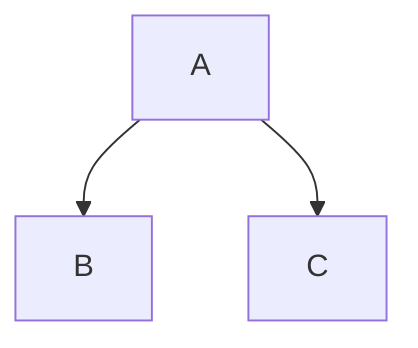

## Overview

**Markdown** was created by [John Gruber](http://daringfireball.net/), with the original guide available [here](http://daringfireball.net/projects/markdown/syntax). However, its syntax varies between different parsers or editors. **Typora** uses [GitHub Flavored Markdown][GFM], and Obsidian's basic formatting syntax can be found [here](https://obsidian.md/help/syntax).

Table of Contents

[toc]

## Block Elements

### Paragraphs and Line Breaks

A paragraph is one or more consecutive lines of text. In markdown source code, paragraphs are separated by two or more blank lines. In Typora, you only need one blank line (press `Enter` once) to create a new paragraph.

Press `Shift` + `Enter` to create a single line break. Most other markdown parsers ignore single line breaks, so to make your line breaks recognizable by other markdown parsers, you can leave two spaces at the end of a line, or insert `<br/>`.

### Headers

Headers use 1 to 6 hash marks (`#`) at the beginning of a line, corresponding to header levels 1 through 6. For example:

```markdown
# Heading 1

## Heading 2

### Heading 3

#### Heading 4

##### Heading 5

###### Heading 6
```

In Typora, enter `#` followed by the header content, then press `Enter` to create a header.

### Blockquotes

Markdown uses email-style `>` characters for blockquotes. They appear as:

> Lorem ipsum dolor sit amet, consectetur adipiscing elit, sed do eiusmod tempor incididunt ut labore et dolore magna aliqua. Ut enim ad minim veniam, quis nostrud exercitation ullamco laboris nisi ut aliquip ex ea commodo consequat. Duis aute irure dolor in reprehenderit in voluptate velit esse cillum dolore eu fugiat nulla pariatur. Excepteur sint occaecat cupidatat non proident, sunt in culpa qui officia deserunt mollit anim id est laborum.
>
> > This is a nested blockquote

In Typora, enter `>` followed by the blockquote content to generate a blockquote. Typora will insert the appropriate `>` or line breaks for you. Nested blockquotes (a blockquote inside another) can be achieved by adding more layers of `>`.

> This is another blockquote with only one paragraph. You can use three blank lines or paragraphs to separate two blockquotes.

### Lists

Enter `* list item` to create an unordered list — the `*` symbol can be replaced with `-` or `+` (recommended in order of priority).

Enter `1. list item` to create an ordered list — their markdown source looks like this:

- Unordered list item 1
- Unordered list item 2
  - Indented sub-item

1. Ordered list item 1
2. Ordered list item 2
   1. Sub-item

### Task Lists

Task lists are lists with items marked as `[ ]` or `[x]` (incomplete or complete). For example:

- [ ] todo list
- [x] done list

You can change the complete/incomplete status by clicking the checkbox in front of the item.

### Fenced Code Blocks

Typora only supports fenced code blocks from GitHub Flavored Markdown. Native Markdown indented code blocks are not supported.

Using fences is simple: enter \`\`\` and press `Enter`. Add an optional language identifier after \`\`\` and we'll apply syntax highlighting:

````gfm
Example:

```js
function test() {
  console.log("Notice the blank line before this function?");
}
```

Syntax highlighting:
```ruby
require 'redcarpet'
markdown = Redcarpet.new("Hello World!")
puts markdown.to_html
```
````

### Math Blocks

You can render _LaTeX_ mathematical expressions using **[MathJax](https://www.mathjax.org/)**.

To add a mathematical expression, enter `$$` and press `Enter`. This triggers an input field that accepts _Tex/LaTex_ source code. For example:

$$
\mathbf{V}_1 \times \mathbf{V}_2 =  \begin{vmatrix}
\mathbf{i} & \mathbf{j} & \mathbf{k} \\
\frac{\partial X}{\partial u} &  \frac{\partial Y}{\partial u} & 0 \\
\frac{\partial X}{\partial v} &  \frac{\partial Y}{\partial v} & 0 \\
\end{vmatrix}
$$

In the markdown source file, math blocks are _LaTeX_ expressions wrapped by a pair of `$$` markers:

```markdown
$$
\mathbf{V}_1 \times \mathbf{V}_2 =  \begin{vmatrix}
\mathbf{i} & \mathbf{j} & \mathbf{k} \\
\frac{\partial X}{\partial u} &  \frac{\partial Y}{\partial u} & 0 \\
\frac{\partial X}{\partial v} &  \frac{\partial Y}{\partial v} & 0 \\
\end{vmatrix}
$$
```

For more details, see [here](https://support.typora.io/Math/).

### Tables

| No. | Name | Gender | birthday | age | id  |
| --- | ---- | ------ | -------- | --- | --- |
| 1   |      |        |          |     |     |
| 2   |      |        |          |     |     |

After creating a table, focusing on it will open a table toolbar where you can resize, align, or delete the table. You can also use the right-click menu to copy and add/delete individual columns/rows. The full syntax for tables is described below, but you don't need to know it in detail because Typora generates the markdown source for tables automatically. In markdown source code, they look like this:

```markdown
| No. | Name | Gender | birthday | age | id  |
| --- | ---- | ------ | -------- | --- | --- |
| 1   |      |        |          |     |     |
| 2   |      |        |          |     |     |
```

You can also include inline Markdown in tables, such as links, bold, italic, or strikethrough.

Finally, by including colons (`:`) in the header row, you can define the text alignment for that column as left, right, or center:

| Left Aligned | Center Aligned | Right Aligned |
| :----------- | :------------: | ------------: |
| Content cell |  Content cell  |  Content cell |
| Content cell |  Content cell  |  Content cell |
| Content cell |  Content cell  |  Content cell |

A colon on the leftmost side indicates a left-aligned column; a colon on the rightmost side indicates a right-aligned column; colons on both sides indicate a center-aligned column.

### Footnotes

```markdown
You can create footnotes like this[^footnote].

[^footnote]: This is the _text_ of the **footnote**.
```

This will generate:

You can create footnotes like this[^footnote].

[^footnote]: This is the _text_ of the **footnote**.

Hover over the "footnote" superscript to view the footnote content.

### Horizontal Rule

Entering `***` or `---` on a blank line and pressing `Enter` will draw a horizontal line.

---

### YAML Front Matter

Typora now supports [YAML Front Matter](http://jekyllrb.com/docs/frontmatter/). Enter `---` at the top of an article and press `Enter` to introduce a metadata block. Alternatively, you can insert a metadata block from Typora's top menu.

### Table of Contents (TOC)

Enter `[toc]` and press `Enter`. This creates a "Table of Contents" area. The TOC extracts all headers from the document, and its content updates automatically as you add to the document.

### Diagrams

To use this feature, first enable it in the Preferences panel. Typora supports diagrams powered by flowchart, sequence diagrams, and mermaid.js.

[See here for more details](https://support.typora.io/Draw-Diagrams-With-Markdown/).



### Callouts / GitHub Flavored Alerts

To use this feature, first enable it in the Preferences panel.

[See here for more details](https://support.typora.io/What's-New-1.8/).

> [!NOTE]  
> This is a note.

> [!WARNING]  
> Warning message.

## Span Elements

Span elements are parsed and rendered immediately upon input. Moving the cursor into the middle of these span elements expands them into markdown source code. Below is an explanation of the syntax for each span element.

### Links

Markdown supports two styles of links: inline and reference.

[Inline link](https://example.com)  
[Reference link][ref]  
[Internal link](#headers)

#### Inline Links

[markdown editor](https://markdown.com.cn/editor/) or [markdown tutorial](https://markdown.com.cn/ "Welcome to the Markdown Chinese Tutorial")

The principle is that Markdown converts your text into HTML format and outputs it:

This is [an example](http://example.com/ "Title") inline link. (`<p>This is <a href="http://example.com/" title="Title"> an example </a> inline link.</p>`)

[This link](http://example.net/) has no title attribute. (`<p><a href="http://example.net/">This link</a> has no title attribute.</p>`)

#### Internal Links

**You can set the href (Hypertext Reference) to a header**, which creates a bookmark that jumps to that section when clicked. For example:

Command (Ctrl on Windows) + click [this link](#block-elements) to jump to the header `Block Elements`. To see how it's written, move the cursor to the link or hold `⌘` and click the link to expand it into markdown source code.

#### Reference Links

Reference links use a second set of brackets, inside which you place a label of your choice to identify the link:

```markdown
This is a [reference link example][id].

Then, anywhere in the document, you can define the link label on its own line, like this:

[id]: http://example.com/ "Optional Text"
```

In Typora, they render like this:

This is a [reference link example][id].

[id]: http://example.com/ "Optional Text"

The implicit link name shortcut allows you to omit the link name, in which case the link text itself will be used as the name. Simply use an empty set of brackets — for example, to link the word "Google" to google.com, you can simply write:

```markdown
[Google][]
Then define the link:

[Google]: http://google.com/
```

In Typora, clicking a link expands it for editing, while Command+Click opens the hyperlink in a web browser.

### URLs

Typora allows you to insert URLs as links, wrapped in `<angle brackets>`.

`<username@domain.com>` becomes <username@domain.com>.

Markdown will also automatically link standard URLs. For example: <www.google.com>.

### Images

The syntax for images is similar to links, but requires an extra `!` character before the link. The syntax for inserting an image is as follows:

```markdown


```

You can insert images from image files or web browsers using drag and drop. You can modify the markdown source code by clicking on the image. If images added via drag and drop are located in the same directory or a subdirectory of the currently edited document, relative paths will be used.

If you are building a website with markdown, you can specify a URL prefix for image preview on your local computer via the `typora-root-url` attribute in YAML Front Matter. For example, enter `typora-root-url:/User/Abner/Website/typora.io/` in YAML Front Matter, then `` will be treated as `` in Typora.

For more details, see [here](https://support.typora.io/Images/).

### _Italic_

Markdown treats asterisks (`*`) and underscores (`_`) as indicators of emphasis (using `*` is strongly recommended to avoid naming conflicts). Text wrapped with a single `*` or `_` will be wrapped in an HTML `<em>` tag. For example:

```markdown
_Single asterisks_

_Single underscores_
```

GFM ignores underscores within words, which is commonly used in code and names, such as:

> wow_great_stuff
>
> do_this_and_do_that_and_another_thing.

To output a literal asterisk or underscore where it would otherwise be used as an emphasis delimiter, you can escape it with a backslash:

```markdown
\*This text is surrounded by literal asterisks\*
```

### **Bold**

Double `*` or `_` will wrap their enclosed content in an HTML `<strong>` tag, for example:

```markdown
**Double asterisks**

**Double underscores**
```

### `Code`

To indicate inline code, wrap it with backticks (`). Unlike preformatted code blocks, inline code indicates code within a normal paragraph. For example:

```markdown
Use the `printf()` function.
```

This will generate:

Use the `printf()` function.

### ~~Strikethrough~~

GFM adds syntax for creating strikethrough text, which is not present in standard Markdown.

`~~Mistaken text~~` becomes ~~Mistaken text~~.

### <u>Underline</u>

Underline is implemented through native HTML.

`<u>Underlined text</u>` becomes <u>Underlined text</u>.

### Emoji :smile:

Use the `:emoji:` syntax to enter Emoji.

You can trigger Emoji autocomplete suggestions by pressing the `ESC` key, or have it triggered automatically after enabling it in the Preferences panel. Alternatively, you can directly insert UTF-8 Emoji characters from the menu bar by selecting `Edit` -> `Emoji & Symbols` (macOS). On Windows, use `Win` + `.` (period).

### Inline Math

To use this feature, first enable it in the `Preferences` panel -> `Markdown` tab. Then use `$` to wrap TeX commands. For example: `$\lim_{x \to \infty} \exp(-x) = 0$` will be rendered as a LaTeX command: $\lim_{x \to \infty} \exp(-x) = 0$.

For more details, see [here](https://support.typora.io/Math/).

### H~2~O Subscript

### X^2^ Superscript

### ==Highlight==

## HTML

You can use HTML to style content that plain Markdown does not support. For example, use `<span style="color:red">text</span>` to add <span style="color:red">red</span> text.

### Embedded Content

Some websites provide iframe-based embed codes, which you can also paste into Typora. For example:

```Markdown
<iframe height='265' scrolling='no' title='Fancy Animated SVG Menu' src='http://codepen.io/jeangontijo/embed/OxVywj/?height=265&theme-id=0&default-tab=css,result&embed-version=2' frameborder='no' allowtransparency='true' allowfullscreen='true' style='width: 100%;'></iframe>
```

<iframe height='265' scrolling='no' title='Fancy Animated SVG Menu' src='http://codepen.io/jeangontijo/embed/OxVywj/?height=265&theme-id=0&default-tab=css,result&embed-version=2' frameborder='no' allowtransparency='true' allowfullscreen='true' style='width: 100%;'></iframe>

### Video

You can embed videos using the `<video>` HTML tag. For example:

```Markdown
<video src="xxx.mp4" />
```

<video src="../../assets/audio/FurElise.ogg" controls=""></video>

### Other HTML Support

For more details, see [here](https://support.typora.io/HTML/).

[GFM]: https://help.github.com/articles/github-flavored-markdown/ "GitHub Flavored Markdown"

## Reference

[Markdown For Typora](https://support.typora.io/Markdown-Reference/)

[Obsidian basic formatting syntax](https://obsidian.md/help/syntax)

[Quickstart for writing on GitHub](https://docs.github.com/en/get-started/writing-on-github/getting-started-with-writing-and-formatting-on-github/quickstart-for-writing-on-github)

[CommonMark-Fundamental yet rigorous standardized grammatical norms](https://commonmark.org/)

[GitHub Flavored Markdown Spec](https://github.github.com/gfm/)
