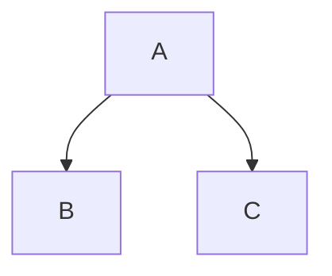

## Typora

**Markdown** 由 [John Gruber](http://daringfireball.net/) 创建，原始指南见[此处](http://daringfireball.net/projects/markdown/syntax)。但其语法在不同解析器或编辑器之间有所不同，**Typora** 使用的是 [GitHub 风格的 Markdown][GFM]，Obsidian的基本格式语法可以参考[此处](https://obsidian.md/zh/help/syntax)。

目录

[toc]

## 块元素

### 段落和换行

段落是一个或多个连续的文本行。在 markdown 源码中，段落由两个或更多空行分隔。在 Typora 中，您只需一个空行（按一次 `Enter`）即可创建新段落。

按 `Shift` + `Enter` 可创建单个换行。大多数其他 markdown 解析器会忽略单个换行，因此为了让其他 markdown 解析器识别您的换行，您可以在行尾留两个空格，或者插入 `<br/>`。

### 标题

标题在行首使用 1 到 6 个井号（`#`），分别对应标题级别 1 到 6。例如：

```markdown
# 一级标题

## 二级标题

### 三级标题

#### 四级标题

##### 五级标题

###### 六级标题
```

在 Typora 中，输入 `#` 后跟标题内容，然后按 `Enter` 键即可创建标题。

### 引用

Markdown 使用电子邮件风格的 `>` 字符表示引用。它们呈现为：

> Lorem ipsum dolor sit amet, consectetur adipiscing elit, sed do eiusmod tempor incididunt ut labore et dolore magna aliqua. Ut enim ad minim veniam, quis nostrud exercitation ullamco laboris nisi ut aliquip ex ea commodo consequat. Duis aute irure dolor in reprehenderit in voluptate velit esse cillum dolore eu fugiat nulla pariatur. Excepteur sint occaecat cupidatat non proident, sunt in culpa qui officia deserunt mollit anim id est laborum.
>
> > 这是嵌套引用

在 Typora 中，输入 `>` 后跟引用内容将生成引用块。Typora 会为您插入合适的 `>` 或换行。通过添加更多层的 `>` 可以实现嵌套引用（引用中的引用）。

> 这是另一个只有一段的引用。可以使用三个空行或者段落来分隔两个引用。

### 列表

输入 `* 列表文本` 将创建无序列表 —— `-` 符号可替换为 `*` 或 `+`（按优先级推荐）。

输入 `1. 列表文本` 将创建有序列表 —— 它们的 markdown 源码如下：

- 无序列表项 1
- 无序列表项 2
  - 缩进子项

1. 有序列表项 1
2. 有序列表项 2
   1. 子项

### 任务列表

任务列表是带有标记为 `[ ]` 或 `[x]`（未完成或已完成）项的列表。例如：

- [ ] todo list
- [x] done List

您可以通过单击项目前的复选框来更改完成/未完成状态。

### 围栏代码块

Typora 仅支持 GitHub 风格 Markdown 中的围栏式代码块。原生 Markdown 的缩进代码块不被支持。

使用围栏很简单：输入 \`\`\` 然后按 `Enter`。在 \`\`\` 后面添加可选的语言标识符，我们会对其进行语法高亮：

````gfm
示例：

```js
function test() {
  console.log("注意这个函数前面的空行？");
}
```

语法高亮：
```ruby
require 'redcarpet'
markdown = Redcarpet.new("Hello World!")
puts markdown.to_html
```
````

### 数学公式块

您可以使用 **[MathJax](https://www.mathjax.org/)** 渲染 _LaTeX_ 数学表达式。

要添加数学表达式，输入 `$$` 并按 `Enter` 键。这会触发一个接受 _Tex/LaTex_ 源码的输入字段。例如：

$$
\mathbf{V}_1 \times \mathbf{V}_2 =  \begin{vmatrix}
\mathbf{i} & \mathbf{j} & \mathbf{k} \\
\frac{\partial X}{\partial u} &  \frac{\partial Y}{\partial u} & 0 \\
\frac{\partial X}{\partial v} &  \frac{\partial Y}{\partial v} & 0 \\
\end{vmatrix}
$$

在 markdown 源文件中，数学块是由一对 `$$` 标记包裹的 _LaTeX_ 表达式：

```markdown
$$
\mathbf{V}_1 \times \mathbf{V}_2 =  \begin{vmatrix}
\mathbf{i} & \mathbf{j} & \mathbf{k} \\
\frac{\partial X}{\partial u} &  \frac{\partial Y}{\partial u} & 0 \\
\frac{\partial X}{\partial v} &  \frac{\partial Y}{\partial v} & 0 \\
\end{vmatrix}
$$
```

更多详情请参见[此处](https://support.typora.io/Math/)。

### 表格

| No. | Name | Gender | birthdaty | age | id  |
| --- | ---- | ------ | --------- | --- | --- |
| 1   |      |        |           |     |     |
| 2   |      |        |           |     |     |

创建表格后，聚焦该表格会打开一个表格工具栏，您可以在其中调整大小、对齐或删除表格。您也可以使用右键菜单来复制以及添加/删除单个列/行。表格的完整语法如下所述，但您不需要详细了解完整语法，因为 Typora 会自动生成表格的 markdown 源码。在 markdown 源码中，它们看起来像：

```markdown
| No. | Name | Gender | birthdaty | age | id  |
| --- | ---- | ------ | --------- | --- | --- |
| 1   |      |        |           |     |     |
| 2   |      |        |           |     |     |
```

您还可以在表格中包含行内 Markdown，例如链接、粗体、斜体或删除线。

最后，通过在标题行中包含冒号（`:`），您可以定义该列文本为左对齐、右对齐或居中对齐：

| 左对齐     |  居中对齐  |     右对齐 |
| :--------- | :--------: | ---------: |
| 内容单元格 | 内容单元格 | 内容单元格 |
| 内容单元格 | 内容单元格 | 内容单元格 |
| 内容单元格 | 内容单元格 | 内容单元格 |

最左侧的冒号表示左对齐列；最右侧的冒号表示右对齐列；两侧都有冒号表示居中对齐列。

### 脚注

```markdown
您可以像这样创建脚注[^footnote]。

[^footnote]: 这是**脚注**的*文本*。
```

将生成：

您可以像这样创建脚注[^footnote]。

[^footnote]: 这是**脚注**的_文本_。

将鼠标悬停在“footnote”上标上以查看脚注内容。

### 水平分割线

在空行上输入 `***` 或 `---` 然后按 `Enter` 将绘制一条水平线。

---

### YAML Front Matter

Typora 现在支持 [YAML Front Matter](http://jekyllrb.com/docs/frontmatter/)。在文章顶部输入 `---` 然后按 `Enter` 以引入元数据块。或者，您可以从 Typora 的顶部菜单插入元数据块。

### 目录（TOC）

输入 `[toc]` 然后按 `Enter` 键。这将创建一个“目录”区域。TOC 从文档中提取所有标题，其内容会随您添加文档而自动更新。

### 图表

要使用此功能，请先在偏好设置面板中启用。Typora 支持由 flowchart、sequence diagrams 和 mermaid.js 驱动的图表。

[更多详情请参见此处](https://support.typora.io/Draw-Diagrams-With-Markdown/)。



### 标注 / GitHub 风格提醒

要使用此功能，请先在偏好设置面板中启用。

[更多详情请参见此处](https://support.typora.io/What's-New-1.8/)。

> [!NOTE]  
> 这是一个提示。

> [!WARNING]  
> 警告信息。

## 行元素

行元素将在输入后立即解析并渲染。将光标移到这些行元素中间会将其展开为 markdown 源码。下面是对每个行元素语法的说明。

### 链接

Markdown 支持两种风格的链接：行内式和引用式。

[行内链接](https://example.com)  
[引用链接][ref]  
[内部跳转](#标题)

#### 行内链接

[markdown editor](https://markdown.com.cn/editor/)或[markdown tutorial](https://markdown.com.cn/ "欢迎访问markdown中文教程")

原理是Markdown会将您的文字转换为html格式并输出：

This is [an example](http://example.com/ "Title") inline link. (`<p>This is <a href="http://example.com/" title="Title"> an example </a> inline link.</p>`)

[This link](http://example.net/) has no title attribute. (`<p><a href="http://example.net/">This link</a> has no title attribute.</p>`)

#### 内部链接

**您可以将 href （Hypertext Reference）设置为标题**，这将创建一个书签，单击后跳转到该章节。例如：

命令（Windows 下：Ctrl）+ 单击 [此链接](#块元素) 将跳转到标题 `块元素`。要了解如何编写，请将光标移到该链接或按住 `⌘` 键单击该链接将其展开为 markdown 源码。

#### 引用式链接

引用式链接使用第二组方括号，在其中放置您选择的标签来标识链接：

```markdown
这是一个 [示例][id] 引用式链接。

然后，在文档中的任何位置，您可以单独在一行上定义链接标签，如下所示：

[id]: http://example.com/ "可选文本"
```

在 Typora 中，它们渲染如下：

这是一个 [示例][id] 引用式链接。

[id]: http://example.com/ "可选文本"

隐式链接名称快捷方式允许您省略链接名称，此时链接文本本身将用作名称。只需使用一组空的方括号 —— 例如，要将单词 “Google” 链接到 google.com 网站，您可以简单地写：

```markdown
[Google][]
然后定义链接：

[Google]: http://google.com/
```

在 Typora 中，单击链接会将其展开以便编辑，命令+单击会在 Web 浏览器中打开超链接。

### URL

Typora 允许您将 URL 作为链接插入，包裹在 `<`尖括号`>` 中。

`<username@domain.com>` 变成 <username@domain.com>。

markdown也会自动链接标准 URL。例如：www.google.com。

### 图片

图片的语法与链接类似，但需要在链接开始前多一个 `!` 字符。插入图片的语法如下：

```markdown


```

您可以使用拖放操作从图片文件或 Web 浏览器插入图片。您可以通过单击图片来修改 markdown 源码。如果使用拖放添加的图片位于当前编辑文档的同一目录或子目录中，将使用相对路径。

如果您使用 markdown 构建网站，您可以在 YAML Front Matter 中通过属性 `typora-root-url` 为本地计算机上的图片预览指定 URL 前缀。例如，在 YAML Front Matter 中输入 `typora-root-url:/User/Abner/Website/typora.io/`，然后 `` 在 Typora 中会被视为 ``。

更多详情请参见[此处](https://support.typora.io/Images/)。

### _斜体_

Markdown 将星号（`*`）和下划线（`_`）视为强调标识（强烈推荐使用`*`避免命名冲突）。用一个 `*` 或 `_` 包裹的文本将被 HTML `<em>` 标签包裹。例如：

```markdown
_单个星号_

_单个下划线_
```

GFM 会忽略单词中的下划线，这常用于代码和名称中，例如：

> wow_great_stuff
>
> do_this_and_do_that_and_another_thing.

要在原本会被用作强调分隔符的位置输出字面星号或下划线，您可以用反斜杠转义它：

```markdown
\*这段文本被字面星号包围\*
```

### **加粗**

双 `*` 或 `_` 会将其包含的内容用 HTML `<strong>` 标签包裹，例如：

```markdown
**双星号**

**双下划线**
```

### `代码`

要表示行内代码，请用反引号（`）将其包裹。与预格式化代码块不同，行内代码表示普通段落中的代码。例如：

```markdown
使用 `printf()` 函数。
```

将生成：

使用 `printf()` 函数。

### ~~删除线~~

GFM 添加了创建删除线文本的语法，这是标准 Markdown 所没有的。

`~~错误文本~~` 变为 ~~错误文本~~。

### <u>下划线</u>

下划线通过原生 HTML 实现。

`<u>下划线</u>` 变为 <u>下划线</u>。

### Emoji :smile:

使用 `:emoji:` 语法输入 Emoji。

用户可以通过按 `ESC` 键触发 Emoji 的自动补全建议，或者在偏好设置面板启用后自动触发。同时，您也可以直接在菜单栏中选择 `编辑` -> `Emoji 与符号`（macOS）来输入 UTF-8 Emoji 字符。window使用`win`+`period`

### 行内数学公式

要使用此功能，请先在 `偏好设置` 面板 -> `Markdown` 选项卡中启用。然后使用 `$` 包裹 TeX 命令。例如：`$\lim_{x \to \infty} \exp(-x) = 0$` 将被渲染为 LaTeX 命令：$\lim_{x \to \infty} \exp(-x) = 0$。

更多详情请参见[此处](https://support.typora.io/Math/)。

### H~2~O 下标

### X^2^ 上标

### ==高亮==

## HTML

您可以使用 HTML 来样式化纯 Markdown 不支持的内容。例如，使用 `<span style="color:red">文本</span>` 来添加<span style="color:red">红色</span>文本。

### 嵌入内容

一些网站提供基于 iframe 的嵌入代码，您也可以将其粘贴到 Typora 中。例如：

```Markdown
<iframe height='265' scrolling='no' title='Fancy Animated SVG Menu' src='http://codepen.io/jeangontijo/embed/OxVywj/?height=265&theme-id=0&default-tab=css,result&embed-version=2' frameborder='no' allowtransparency='true' allowfullscreen='true' style='width: 100%;'></iframe>
```

<iframe height='265' scrolling='no' title='Fancy Animated SVG Menu' src='http://codepen.io/jeangontijo/embed/OxVywj/?height=265&theme-id=0&default-tab=css,result&embed-version=2' frameborder='no' allowtransparency='true' allowfullscreen='true' style='width: 100%;'></iframe>

### 视频

您可以使用 `<video>` HTML 标签嵌入视频。例如：

```Markdown
<video src="xxx.mp4" />
```

<video src="../../assets/audio/FurElise.ogg" controls=""></video>

### 其他 HTML 支持

更多详情请参见[此处](https://support.typora.io/HTML/)。

[GFM]: https://help.github.com/articles/github-flavored-markdown/ "GitHub Flavored Markdown"

## 参考

[Markdown For Typora](https://support.typora.io/Markdown-Reference/)

[Obsidian basic formatting syntax](https://obsidian.md/help/syntax)

[Quickstart for writing on GitHub](https://docs.github.com/en/get-started/writing-on-github/getting-started-with-writing-and-formatting-on-github/quickstart-for-writing-on-github)

[CommonMark-Fundamental yet rigorous standardized grammatical norms](https://commonmark.org/)

[GitHub Flavored Markdown Spec](https://github.github.com/gfm/)
