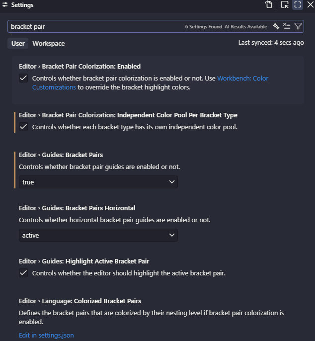

## Bracket Pair

### What is Bracket Pair？

Bracket pair colorization is a built-in code editor feature that visually matches opening and closing brackets, braces, and parentheses by assigning them distinct colors based on their nesting depth

### 开启

`Ctrl + ,` 打开 setting



或在 `settings.json` 中添加以下配置：

```json
{
  "editor.bracketPairColorization.enabled": true,
  "editor.bracketPairColorization.independentColors": true,
  "editor.guides.bracketPairs": "active"
}
```

> `editor.guides.bracketPairs` 可选 `"active"`（仅当前光标所在括号对显示连线）或 `"all"`（显示全部嵌套层级连线）。

### Bracket Pair 不生效

如果你已经开启了上述设置但括号仍然没有颜色，问题很可能出在 `settings.json` 中的这两行：

```json
"editor.language.brackets": [],
"editor.language.colorizedBracketPairs": []
```

**解决方案：将它们删除或注释掉。**

- `editor.language.brackets: []` 会清空 VS Code 默认的括号配对定义（默认为 `[["[", "]"], ["(", ")"], ["{", "}"]]`），导致括号配对识别失效
- `editor.language.colorizedBracketPairs: []` 则会覆盖默认的彩色括号配对列表，导致即使 `enabled: true` 也没有任何括号被着色

删除这两行后重启 VS Code 即可恢复。

### 其他常见原因

1. **语言模式错误**：右下角显示 Plain Text 时括号不会被识别，点击切换为正确语言
2. **旧插件冲突**：Bracket Pair Colorizer 等旧插件与原生功能冲突，建议删除
3. **主题不支持**：部分轻量主题未声明括号渲染能力，可切换为 Dark+ 测试

### 结语

括号不着色，先检查 `editor.bracketPairColorization.enabled` 是否为 `true`；若仍无效，去 `settings.json` 中搜 `editor.language.brackets` 和 `editor.language.colorizedBracketPairs`，**删掉它们**——大多数情况下问题就此解决。
