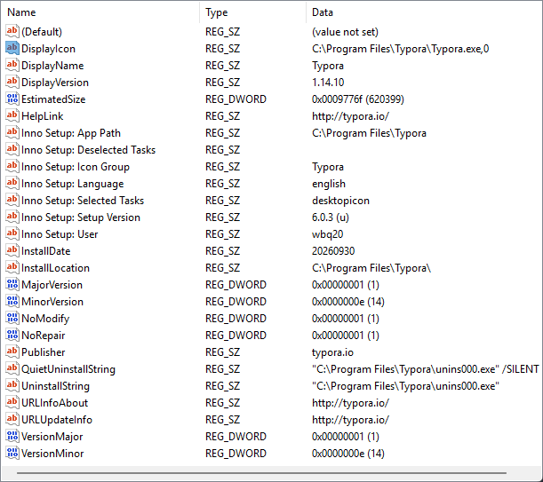

软件在“已安装的应用”列表里图标变成白纸，重装也无效，通常说明注册表里 `DisplayIcon` 指向的路径已经失效。Windows 找不到图标文件，就会退回默认的空白文档样式。手动把这个值指回主程序的实际路径，是最直接的对症修复方式。

## 定位注册表项

按 `Win + R`，输入 `regedit` 打开注册表编辑器。

在顶部地址栏粘贴以下路径之一，回车定位：

```text
计算机\HKEY_LOCAL_MACHINE\SOFTWARE\Microsoft\Windows\CurrentVersion\Uninstall
```

或者：

```text
计算机\HKEY_CURRENT_USER\SOFTWARE\Microsoft\Windows\CurrentVersion\Uninstall
```

左侧会列出所有已安装程序的子项，名称通常是随机 GUID 或软件名。逐个点击，在右侧找到 `DisplayName` 值等于目标软件名（例如 `Typora`）的那一项。

## 修改 DisplayIcon

在该项的右侧列表中，找到名为 `DisplayIcon` 的字符串值（`REG_SZ`）。

- 如果存在：双击它，把“数值数据”改成主程序 `exe` 的完整路径。
- 如果不存在：右键空白处 → 新建 → 字符串值，命名为 `DisplayIcon`，再双击填写路径。

路径末尾建议加上 `,0`，表示使用该程序的第一个图标资源：

```text
C:\Program Files\Typora\Typora.exe,0
```

如果软件装在 D 盘，右键桌面快捷方式 → 属性 → 打开文件所在位置，确认真实的 `exe` 路径后再填入。



## 生效与验证

点击确定，关闭注册表编辑器，重启电脑。图标缓存会在重启后重新读取注册表，多数情况下图标会恢复正常。

如果重启后仍是白纸，可以先重启“Windows 资源管理器”进程；再不行就删除 `%localappdata%\IconCache.db` 并再次重启，强制重建图标缓存。

## 结语

注册表 `DisplayIcon` 的值必须指向真实存在的 `exe` 路径，结尾加 `,0` 指定第一个图标资源。改完重启一次，让系统重新抓取即可。
